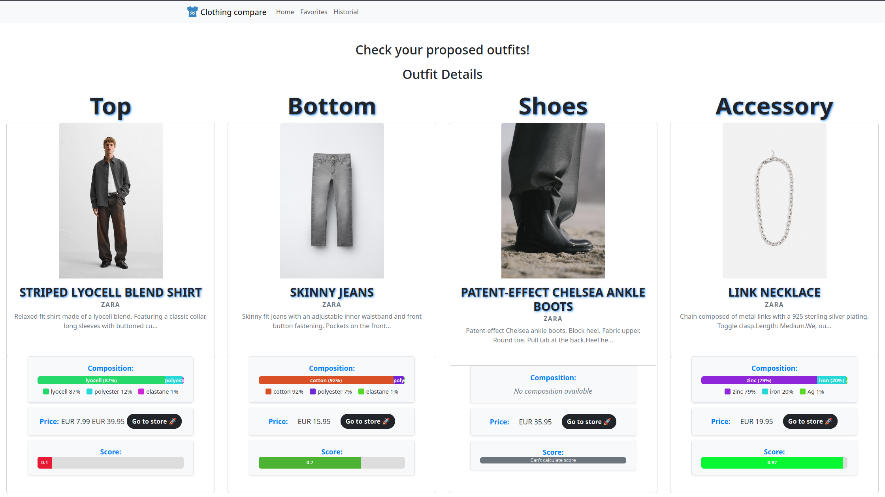

# ClothingCompare


## What is ClothingCompare?
ClothingCompare is an application that helps users find a suitable outfit or other clothing items according to their preferences. The user can either send a picture of a piece of clothing they like, or describe it in a few words and receive personalized suggestions. Users interact through a web portal based on the React Boostrap and Django REST Frameworks, which provides 2 main services:
* The comparison of different purchase options with additional metrics such as a calculated sustainability index.

* The suggestion of outfits through image search or a natural language description done through large language model technologies, which help users find items they don't know they want yet.


This solutions are provided thanks to the InditexTECH REST APIs [VisualSearch](https://developer.inditex.com/apimktplc/web/products/pubapimkt/protocols/REST/apis/visual-search/overview) and [ProductSearch](https://developer.inditex.com/apimktplc/web/products/pubapimkt/protocols/REST/apis/product-search/overview).

ClothingCompare can be accessed both as a REST API with a series of endpoints or as a web portal developed in React.

## Dependencies and deployment
ClothingCompare aims to serve as an easy-to-use and deploy application, so the amount of dependencies has been kept as a minimum.

You only need [Docker](https://www.docker.com/) and the credentials needed for the [InditexTECH REST APIs](https://developer.inditex.com/apimktplc/web/home). 

A quickstart guide to creating an application and attaching APIs to it can be found in [this link](https://developer.inditex.com/apimktplc/web/get-started/overview/quickstart).
This project **requires** adding both the _Product Search_ and the _Visual Search_ APIs.

You will need to set a series of environment variables in your system prior to deploying the Docker infraestructure.

The Inditex API secrets are configured on the `.apikeys.env` file, located on this repository root, as follows:
* **USER_INDITEX_API->** Your OATH2 Client ID from your application.
* **SECRET_INDITEX_API->** Your OATH2 Client ID from your application.
* **ACCESTOKEN_URL_INDITEX_API->** Your OAuth2 Accesstoken URL. Varies between the API sandbox and production modes.
You can find an example file `apikeys.example.env` that you can rename to `.apikeys.env` and fill out with your API credentials.
It's critical that you have your Application promoted to production, the mentioned APIs added to it and authorized to perform requests.

The product recommendations and outfit suggestion engine uses Large Language Models (LLMs) run on the Ollama framework. It allows us to download, run, and solve queries locally using any Ollama compatible models. Two different models are used. One for text-to-text, and another for image-to-text queries, and can be configured on the `models.env` environment file.
* **TEXT_MODEL->** Name of the Ollama LLM model for text-based queries. Defaults to `llama3.2:3b`.
* **VISUAL_MODEL->** Name of the Ollama LLM model for image-based queries. Defaults to `llava:7b`.

Compatible text models are listed on the following page: [Ollama Models](https://ollama.com/search). In the case of the visual model, only the ones with the "vision" tag are supported: [Ollama Vision Models](https://ollama.com/search?c=vision). The models configured on the `models.env` file are not bundled or distributed with this project, nor have been modified for our purposes. They will be automatically downloaded from the sources listed at the official Ollama repositories on deployment.

By default, this project uses the LLaMA 3.2 and LLaVA models for testing the application. As such their license is included in our project's [license](/LICENSE).

### Docker infraestructure
The project creates three containers. One for the frontend, one for the backend, and one for the ollama framework. The entire docker infraestructure is defined on the docker-compose `compose.yml` file.

LLMs are quite computationally intensive, and as such, they can be sped up considerably by using a GPU, if available on the system. We've included configuration that allows Nvidia GPUs to accelerate the Ollama framework. This functionality requires the [NVIDIA Container Toolkit](https://docs.nvidia.com/datacenter/cloud-native/container-toolkit/latest/install-guide.html) to be installed. Then, you can enable this functionality by uncommenting the code block prefixed by "Enable GPU Support" on the `compose.yml` file.

The docker infraestructure can then be deployed by running `docker compose up` on the project directory.

## How does it work?
ClothingCompare helps users find a suitable outfit or other clothing items according to their preferences. The user can either send a picture of a piece of clothing they like, or describe it in a few words and receive personalized suggestions. Users interact through a web portal developed in React, created with ease-of-use and flexibility in mind. The web portal sends queries via a REST API to a backend service, that uses InditexTECH's _Product Search_ and the _Visual Search_ APIs to obtain product suggestions. Web-scraping techniques are employed to obtain information that is not directly available on the InditexTech API Products, such as the fabric materials and composition used on the different items. The outfit suggestions are powered by LLaMA 3.1, for text-to-text instructions, and LLaVA, for image-to-text extraction, using the Ollama framework.

### Services
The backend container runs the main business logic. It exposes a series of REST APIs and orchestrates all the actions of the application, including sending calls and receiving responses to and from the ollama container. It exposes the API through port 8000.
The frontend container exposes an user interface, allowing easy interaction and visualization with the information provided by the backend. The UI is exposed through port 8080.
Finally, the ollama framework container is the responsible of running inference on the LLM models.

The following ports are exposed externally on the docker deployment, giving access to the different functions:
| Function | Port |
|----------|------|
| REST API Backend | 8000 |
| User interface (frontend) | 8080 |

### Backend
Firstly, before introducing the API, we introduce our json result for clothing retrieval. Information is added to the results provided by the Inditex API through web-scraping that is performed over the store webpages of the products and it's done natively on Python through the BeautifulSoup package. This information is used to enrich our data and provide a better comparison system, using values such as the materials of the clothing. We've explored the web pages of all of the Inditex brands available on the API. However, due to technical and time limitations, we've only implemented scraping for the Zara website.
For web-scraping Zara websites it is important to indicate that 2 requests are made, one for the initial website, which returns a dummy website with no information. We search for the redirection address and then we make a second request to the server. 
This way, we can perform the scraping through Beautiful Soup and the request package only without a web browser, allowing for faster data compiling.

We call this struct ClothingDetail and an example can be found below:
```json
{
        "id": "414956079",
        "name": "Z1975 TIE DENIM SHIRT",
        "price_currency": "EUR",
        "price_current": 29.95,
        "price_original": null,
        "link": "https://zara.com/es/en/-P06147169.html?v1=414965706",
        "brand": "zara",
        "color": "Blue ",
        "description": "High neck long sleeve shirt with tie.",
        "composition": [
            {
                "material": "cotton",
                "percentage": "64"
            },
            {
                "material": "viscose",
                "percentage": "36"
            }
        ],
        "image_url": "https://static.zara.net/assets/public/5454/62b2/8ebd4852aed1/50fb7eadd922/06147169407-000-p/06147169407-000-p.jpg?ts=1740154383215&w=1920",
        "score": 27.200000000000003
    }
```

The services available from the API are:
* **clothing_app/** -> Allows to add clothing following the ClothingDetail model through a POST request and list all added clothes in the database with a GET request.
* **clothing_app/user_clothing/\<username>** -> Allows for the viewing of all images that an user has uploaded as a GET request or to upload an image through a POST request. Add \\<image_id> to see only that specific image in a GET Request or remove it through a DELETE request.
* **clothing_app/wishlist/\<username>** -> Allows for the viewing of all wishlisted clothes by a specific user as a GET request or to add a clothing to its wishlist through a POST request. Add \\<clothing_id> to see only a specific wishlisted clothing with a GET request or remove it with a DELETE request.
* **clothing_app/product_search** -> Allows for the search of similar items in Inditex shops that the one that is described in the input of a GET Request. The parameters 'description' is compulsory and it will be used to search for similar items while the parameter 'brand' is optional and will be used to search in a specific store. The results will be returned in the ClothingDetail struct.
* **clothing_app/visual_search** -> Allows for the search of similar items from an image included in a POST request. The image must be uploaded in any server and it's included as img_url parameter in the request data. The results are returned in the ClothingDetail struct.
* **clothing_app/visual_search/outfit_search** -> From a ClothingDetail struct included in the data of the POST Request, we provide an outfit recommendation of 5 outfits provided by an LLM-model. These outfits are then passed through the ProductSearch API in order to find shop products that represent them and are enriched through web scraping. They are then returned to be compared.
* **clothing_app/visual_search/outfit_photo_search/** -> Similar to the last one, except it takes a photo provided in the same format as in the **visual_search** endpoint. It returns the outfits that match the piece of clothing sent as a photo.
* **clothing_app/prompt_search** -> From a 'description' parameter in natural language, it uses the LLM-model to extract the keywords in a format that is acceptable for the InditexTECH API (due to size limitations) and it searches for products that suite the style or needs reflected in the parameter.

Apart from the API, the React webpage provides an easy-to-use reactive and interactive interface that allows for photo uploading, taking of photographies through webcam for the visual endpoints, as well as text-based prompts for text-based endpoints. 

#### Image storage
We've incorporated image uploading capabilities in order to find similar clothes to the one in the image. The Inditex _Visual Search_ API expects an url to an image, and does not support direct upload of images. For this reason, we've decided to use an external temporary file storage solution, [/TMP/FILES](https://tmpfiles.org/). This service allows uploading any file, and retains it for 60 minutes. This allowed us to externallize this functionality, and develop the proof-of-concept of the application faster. However, for privacy and stability reasons, this functionality could be added locally in the future.

## Issues
Issues can be filled out in the GitHub page using the templates provided, please be as clear and concise as possible with your issue and one of the mantainers will try to contact you as soon as possible based on the standards and pledges made on our [Contributing](/CONTRIBUTING.md) page.

## How can you be a part of ClothingCompare?
You can contribute to ClothingCompare by solving Issues left by the developers or by other members of the community. Please do mind the limitations, advice and rules that these contributions must comply with. They are compiled in the [Contribution](/CONTRIBUTING.md) file. 
For any security concerns, go to [Security](/SECURITY.md) and follow the instructions within. 

## Git development
In order to speedup development a Git Trunk based development has been applied throughout the project, as most of the work has been done in quick succession on the 'dev' branch.

## Current Contributions
The contributors of this project are the following:
* **oscar-castellanos->** Django back-end implementation and Docker composition setup.
* **afdezfraga->** React front-end development, interface design and data model design. 
* **xveiga->** Implementation of LLM-model connection, support on front-end implementation and interface design.
* **Erivos->** Implementation of InditexTECH API connection, web-scraping and support on back-end implementation.

## License
The project is licensed under the GPL-3 License. For more details, please refer to the [LICENSE](./LICENSE) file. Additionally, the licenses  the llama models used in testing can also be found in the [LICENSE](./LICENSE) file.

## What's next for ClothingCompare
ClothingCompare has still a long way to go we have many more ideas and improvements that could be applied. The main points of future work that the current mantainer team has proposed are:
* Add more sustainability metrics.
* Add web-scraping modules for other webs of the Inditex suite.
* User account system to save outfits and searches.
* Local image storage service.
* Suppport for allergenic filtering, checking the fabrics and showing clothing that they need.